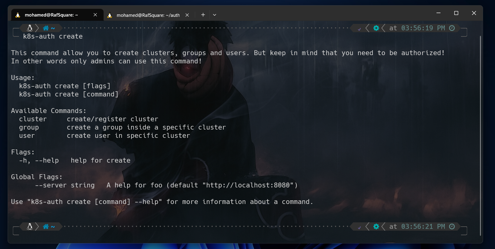

# Introduction 

## How it comes
As a university student, I was assigned to create an authentication project for a specific system. But instead of choosing a traditional approach like Kerberos, I decided to spice things up and bring Kubernetes and cloud-native technologies into the mix (Typical Me). After diving into the official documentation, I was hit with a barrage of authentication strategies like X509 client certs, Static Token File, Bootstrap tokens, Service Accounts, OIDC tokens, and more. My head was spinning! Then I stumbled upon some existing authentication tools like Dex, Keycloak, and Pinniped. Terms like OIDC and OAuth2 were thrown around left and right. But I wasn't intimidated! I accepted the challenge and declared: "It's implementation time!" And thus, the k8s-auth project was born.


## Why k8s-auth is born   

Managing access to Kubernetes clusters can be a challenging task, especially in large organizations where multiple teams and users need different levels of permissions. While Kubernetes provides a robust RBAC system, configuring and maintaining it can be time-consuming and error-prone, particularly if you have many clusters to manage.
It can feel like you're playing a never-ending game of whack-a-mole, trying to keep up with the constant changes and updates. And let's be honest, it's not the most exciting task in the world. Moving from one cluster to another, constantly changing contexts, generating kubeconfig for users, and dealing with permission problems can quickly become a chore. 


## Before Starting

Before you start reading this blog post, let's make sure you're ready to dive into the k8s-auth server world. First, make sure you have a solid understanding of Kubernetes basics and RBAC, as we'll be building on those concepts. Don't worry, we won't ask you to explain any Kubernetes concept in binary code. We just need you to understand what a service account is, what roles and role bindings mean, and why a service account needs a secret. So, if these concepts are still a mystery to you, go ahead and brush up on your Kubernetes knowledge before jumping in. And if you need a refresher, don't worry, we won't judge you. We'll just send you back to Kubernetes school.

# K8S-AUTH : The SSO-Based Authentication Mechanism for Multi-Clusters!

## What is k8s-auth ?

K8s-auth is a tool that provides authentication and authorization mechanisms for multiple Kubernetes clusters. With k8s-auth, users can authenticate to multiple clusters using a single set of credentials. This eliminates the need for users to have different credentials for different clusters, simplifying the authentication process. K8s-auth also allows administrators to manage user and group permissions across multiple clusters from a single centralized location, making it easier to maintain security and access control.


## The Authentication server

"K8s-Auth Server" is an open-source authentication server designed to simplify the authorization and authentication process for users and groups within specific Kubernetes clusters. With this server, administrators can easily manage access controls for multiple clusters, all from a centralized location. 


With the k8s-auth server, you can say goodbye to the headache of managing RBAC configurations across multiple clusters. Instead, you can focus on the fun part of being an admin - creating users, deleting users, modifying users, creating groups, deleting groups, modifying groups, and more! And the best part? You get to do it all with a single set of credentials, like a master key that unlocks all the doors to the kingdom of Kubernetes.

But wait, there's more! With SSO-based access, users can connect to multiple clusters with different permissions based on their role on each cluster, all without having to enter a password a million times. It's like having a backstage pass to all the coolest Kubernetes events without ever having to wait in line.

## How This Server Communicate with Clusters ?

K8s-Auth Server is designed to work seamlessly with K8s-Auth Controller, a cloud-native application that is deployed within the Kubernetes cluster. This controller acts as an agent for the server, facilitating communication between the server and the cluster.


Before a cluster can be used with K8s-Auth Server, it must be registered with the server by the administrator. When a cluster is registered, a secret token is created, which must be used by the agent/controller deployed within the cluster to verify its existence. Once the agent/controller is verified, a connection between the cluster and the server is opened (web socket) for data communication. 


## How to interact with this Server

K8s-Auth Server comes with a powerful CLI utility that can be used by both administrators and users. The CLI behaves differently based on the user's role - administrators can create, modify, and delete users, groups, and clusters, while normal users can check the clusters that they are authorized to connect with. Once the users selects the cluster they want to authenticate with, the CLI will automatically generate a kubeconfig file, making it easy for users to connect to the cluster and start working. 

## How users logs to the server

To connect to any cluster, users must first authenticate with the K8s-Auth Server. Authentication with the server is done using OAuth2 with Google, allowing users to use one set of credentials to connect to multiple clusters with different permissions based on their role on each cluster. This type of authentication can be referred to as SSO-based authentication. 

## What happen when user want to authenticate to a cluster ?

On the user side, when a user logs into the K8s-Auth Server, they can check the clusters they are authorized to access. After selecting the desired cluster, a request is sent to the server, which checks if the user is authorized to connect. If authorized, the server sends a request to the specific agent/controller, which creates the necessary Kubernetes resources, such as service accounts, roles, role bindings, and secrets, allowing the user to connect to the cluster and return the token and ca.crt that allow the automatic generation of the kubeconfig. 

## The Agent/Controller role 

The agent/controller also manages the lifecycle of the secret and token, deleting them and all related roles and bindings after they expire or are no longer needed. For example, if an administrator decides to remove a user from a cluster, the agent/controller will delete the secret that holds the user's token, as well as the service account, roles, and bindings associated with that user. 

## Before DEMO 


:::danger
Please note that this project is open source and the code is available to anyone interested. It is currently an MVP version that functions effectively, and we plan to add more features in the future.
:::


:::warning

Don't forget that this project is open to contributions from the community! If you find a bug or have a feature request, feel free to open an issue on the project's GitHub page. And if you're interested in helping out with the development, pull requests are always welcome! Let's work together to make this project even better.
:::



- site: k8s-auth-server
  url: https://github.com/Mohamed-Rafraf/k8s-auth-server
  desc: The authentication server 
  image: https://github.githubassets.com/images/modules/logos_page/GitHub-Mark.png
  color: "#2296fd"
- site: k8s-auth-kube
  desc: The Controller/Agent for k8s-auth
  url:  https://github.com/Mohamed-Rafraf/k8s-auth-kube
  image: https://github.githubassets.com/images/modules/logos_page/GitHub-Mark.png
  color: "#de2336"
- site: k8s-auth-cli
  desc: The CLI utility for k8s-auth
  url: https://github.com/Mohamed-Rafraf/k8s-auth-cli
  image: https://github.githubassets.com/images/modules/logos_page/GitHub-Mark.png
  color: "#02bf1b"


# The DEMO ! 

And the icing on the cake? I am going to show you how to set up and use k8s-auth in a demo that will blow your mind (in a good way, of course). So grab your popcorn and let's get this Kubernetes party started!

Ladies and Gentlemen, it's showtime! Let's get ready to k8s-authenticate! We'll be putting the spotlight on three stars of this demo: The Authentication Server, The Agent/Controller, and the Command Line Utility! These babies were born to shine in the Go language (talk about power!) and are all open-source, so you can check them out on my GitHub page. And, to make things even easier, we've containerized the authentication server and agent, so you can just pull them like a cold one on a hot summer day. Check out my Docker Hub profile for more juicy details!

## Setting up Authentication Server

Hold your horses, folks! The authentication server may be containerized, but it's not going inside Kubernetes! Don't forget to set up those environment variables for the server - especially the admin email! (He deserve a name and a full name too, don't they?) And guess what, the admin can log in with Google OAuth2! Just make sure to give the Client ID, Client Secret, and Redirection Link, or else things won't work too smoothly.

> You need to create an OAuth 2.0 Client with the Google API in google cloud platform!


* `K8S_AUTH_ADMIN_NAME`: The administrator name! (My name is default value)
* `K8S_AUTH_ADMIN_FULLNAME`: The administrator name! (My name is default value)
* `K8S_AUTH_ADMIN_MAIL`: The administrator name! (My email is default value)
* `OAUTH2_CLIENT_ID`: The google Oauth2 Client ID (Required)
* `OAUTH2_CLIENT_SECRET`: The google Oauth2 Secret  (Required)
* `OAUTH2_REDIRECT_URL`: The google Oauth2 Redirect URL callback (Required, it must be redirected to /callback endpoint of your server ) 

> Let's assume that the server is deployed on https://auth.4n6nk8s.tech,
`OAUTH2_REDIRECT_URL` must be https://auth.4n6nk8s.tech/callback

It's docker time! `mohamedrafraf/k8s-auth-server` is the docker image that you need! Let's run this server! 

```bash run server
docker run --name server -it -p 80:8080 -e OAUTH2_CLIENT_ID=xxxx -e OAUTH2_CLIENT_SECRET=xxx ... mohamedrafraf/k8s-auth-server
```


Make sure to input all the necessary variables for the server to run smoothly. And once you've done that, sit back and relax, and let the server do its thing! Keep your hands off those logs, let them flow in peace!

## Interacting with server using k8s-auth CLI 

It's CLI installation time, folks! This nifty command line utility is your ticket to the k8s-auth party. With the CLI, you can log in as an admin or regular user and interact with the server based on your permission level.

But wait, there's more! For the first time, only the admin with their fancy schmancy email address can access the server. They'll be the ones registering the cluster, setting up the agent, and creating a connection between the server and the agent. Then, it's time to have some fun with users, groups, and permissions. Who said authentication couldn't be funny?

You can build the command line utility or download it by running: 
```bash download cli
wget https://github.com/Mohamed-Rafraf/k8s-auth-cli/releases/download/test/k8s-auth
sudo chmod +x k8s-auth && sudo mv k8s-auth /usr/bin
```
Now, you can use this command line utility just like any other tool in your system! 


Before start playing with this command line you need to know that on each command you need to specify the authentication server that you want to interact with! So either you user `--server` on each command or use `K8S_AUTH_SERVER` environment variable to make it more easy for you! I'll go with the 2nd option!

```bash export env var
export K8S_AUTH_SEVER=https://auth.4n6nk8s.tech
```

Now you need to log in as an adminstrator! It's not that hard just run `k8s-auth login` and forget to specify `--admin` to login as the super user!


The utility needs a secret token, which you'll get from an URL link. This link will take you to Google for authentication and authorization as an admin. Once you're authorized, you'll get the secret token to paste and everything will be good to go. 

You'll get something like this one in case you're authorized! 


Copy that thing don't worry! Once you paste it, the utility will verify the token and let you know if you're ready for your actions or not! 


Bingo we are ready for action! Now as an admin you can register clusters, create,delete,modify users and groups (and their permissions) inside each cluster!

> Let's assume that you have 2 clusters! You create a user inside cluster1 and you give him permission to list pods on dev namespace. You can add that user to cluster2 with other permission like create secrets on prod namespace

It's time to register a cluster! You'll recieve a secret token.


And as you see here! The cluster is registered using `k8s-auth create cluster` and you can list registred clusters with `k8s-auth get clusters`

> Keep in mind that registerd cluster have 2 status, not Active when the cluster is not verified yet. The Active status will show you the API SERVER address/hostname

> Only Admins can see the tokens! Running the same command as a regular user will list you only the clusters that you have access to it (so not all cluster) and without the token! 

Let's take rest now from the CLI. It's time for kubernetes! Let's deploy the agent/controller that will communicate with the server! 

## Deploy the Agent/Controller inside Kubernetes
Deploying the agent is not rocket science! Deploying the agent is not rocket science! (To be honest i didn't make a helm chart yet, Sadly :( ). But if you want to do it the old fashioned way, no worries! It's still a piece of cake. Just keep in mind that you need to create a namespace called "k8s-auth" in your cluster. This namespace will contain all the service accounts and secrets of the users that authenticate and have a session with the cluster.

The agent's mission is to make sure everyone gets what they need! It creates service accounts, roles, and role bindings to make sure users have the right permissions in the cluster. That's why the agent itself needs a service account and permissions to do its job inside the cluster.


Let's create the namespace and the service account for this agent! 

```yaml create ns & sa
apiVersion: v1
kind: Namespace
metadata:
  name: k8s-auth
spec: {}
status: {}
---
apiVersion: v1
kind: ServiceAccount
metadata:
  name: k8s-auth
  namespace: k8s-auth
```

This service account need a clusterrole that allow to create roles to anything!  to grant permission for creating pods you must have this permission first! You can't give permission of create something and you can't do it!!! 

Next, the service account will need an appropriate permissions to carry out its mission inside the cluster. Specifically, it requires a clusterrole that grants permission to create roles for any resource. 

In kubernetes world, granting permission to create something requires that you have the permission yourself!. For example, you can't grant permission to create pods if you don't have permission to create pods even you have permission to create roles!!

Let's create the clusterole and the binding! 

````yaml create cluster role
apiVersion: rbac.authorization.k8s.io/v1
kind: ClusterRole
metadata:
  creationTimestamp: null
  name: k8s-auth
rules:
- apiGroups: ["*"]
  resources: ["*"]
  verbs: ["*"]

---
apiVersion: rbac.authorization.k8s.io/v1
kind: ClusterRoleBinding
metadata:
  creationTimestamp: null
  name: k8s-auth
roleRef:
  apiGroup: rbac.authorization.k8s.io
  kind: ClusterRole
  name: k8s-auth
subjects:
- kind: ServiceAccount
  name: k8s-auth
  namespace: k8s-auth
````
Now it's time to the last part! we will deploy the agent itself! The agent need to know some information so as expected there is some environement variable! 

* `CLUSTER_NAME`: is the same name that you put it inside the authentication server 
* `TOKEN`: The generated token from the authentication server
* `SERVER`: The authentication server itself
* `API_SERVER`: This is contains the public hostname for the API SERVER. The agent can detect it correctly when you have a cluster inside Network and the cluster is not exposed in the internet 

> I used kubeadm clusters in provisionning clusters. I didn't find a way to find the public hostname! So you need to indicate the api server until it will be fixed!

```yaml deploy
apiVersion: apps/v1
kind: Deployment
metadata:
  creationTimestamp: null
  labels:
    app: k8s-auth
  name: k8s-auth
  namespace: k8s-auth
spec:
  replicas: 1
  selector:
    matchLabels:
      app: k8s-auth
  strategy: {}
  template:
    metadata:
      creationTimestamp: null
      labels:
        app: k8s-auth
    spec:
      serviceAccountName: k8s-auth
      containers:
      - image: mohamedrafraf/k8s-auth-kube 
        name: k8s-auth-kube
        env:
          - name: CLUSTER_NAME
            value: ctf-cluster
          - name: TOKEN
            value: "Z8taw1yFw4lsq7cgSvmZ"
          - name: SERVER
            value: "https://auth.4n6nk8s.tech"
          - name: API_SERVER
            value: https://172.190.91.84:6443
        resources: {}

status: {}
```

After deploying the agent. you can check the clusters with the cli again and you'll find everything is ok! 


The cluster is on Active status and the api server is not empty now! You can repeat this operation with many clusters and this is how multi-clusters can work together! 

## Create Users and Groups 

The cluster is now ready for authentication and has been verified to be functioning without any issues. The connection between the cluster and authentication has been established. Now, let's proceed to creating groups and users.

Let's see what `k8s-auth create` can do for us! 



Great news! With the `k8s-auth create` command, you can easily create groups and users for your authenticated clusters. To create a group, simply specify the cluster and provide a YAML manifest file containing the roles for that group. For creating a user, you can either assign them to an existing group or provide a YAML manifest file for the user's roles if they do not belong to any group.

Let's define the role for our group that we will create!

```yaml group rule
kind: Role
apiVersion: rbac.authorization.k8s.io/v1
metadata:
  namespace: dev
  name: pod-and-secret
rules:
- apiGroups: [""]
  resources: ["pods","secrets"]
  verbs: ["list","create"]

---
kind: Role
apiVersion: rbac.authorization.k8s.io/v1
metadata:
  namespace: prod
  name: pod-list
rules:
- apiGroups: [""]
  resources: ["pods"]
  verbs: ["list"]
``` 

The group we're about to create will be granted permission to create and list pods and secrets in the "dev" namespace, while they will only be able to list pods in the "prod" namespace.

> Any user will be belong to this group will have these permissions! You don't have to repeat the same manifest for each user!. This is why groups exists! 

This command will create the group for you 
```bash command
k8s-auth create group <name> --cluster=<cluster> --file=<rbac_file>
```


As you can see here! The group is create successfully and you can see his permission when you forget it using `k8s-auth get permission` command! 

You can discover what you can do with `k8s-auth get` command!! You can a list users too! 


Now let's create a user that belong to this group! So we don't need to specify any manifest file that define roles! 

```bash user
k8s-auth create user --name <name> --fullname <value> --mail <mail> --cluster <cluster> --group <group>
```

In case that you want to create a user that don't belongs to any group and have his own permission you can delete the `--group` and change it with `--file` and specify the yaml file that contains his roles! 

> No need to worry about naming roles because there won't be any overlapping between them. The agent takes care of creating roles and bindings in the background, and the names you specify in the manifest won't be used directly.


You can update the permission using the `k8s-auth update permisssion` command! This command can update groups and users permission

In case you change the permission for a user that belgons to a group. This user will leave that group because he will have his own permissions (different from the group one)


> You can't delete a group if is not empty!

> When User have an opened session with a cluster and use kubectl normally and you decide to delete that user the session will be closed and he can't do anything! 

## Authenticate to a cluster

As a regular user you need to login to the authentication server using `k8s-auth login` and you'll receive a link as the admin login process! 

Then you can list the clusters that you can authenticate with using `k8s-auth get clusters` and keep in your mind that you'll never see the token of each cluster (Only admins can see tokens)

Once you decided which cluster you'll authenticate! run the command `k8s-auth auth` with specifying the cluster name!

```bash authenticate
k8s-auth auth cluster=ctf-cluster

To use this cluster run this command: export KUBECONFIG=$HOME/.k8s-auth.config
```

If you're authorized, you'll receive a message like that! What is happening? 

Actually the k8s-auth CLI generate a kubeconfig file for you! run the command that the CLI suggest to you! BOOOM Start Kubectlying !!! xD 


## Conclusion

As highlighted in the blog post, the process of authentication has been simplified with just 3 simple commands - login, auth, and export KUBECONFIG. These commands enable users to easily open a session with any cluster they want, regardless of the number of clusters and different permissions required, using just a single set of credentials. Additionally, the administrator can easily set up agents in the clusters, and manage the permissions and the entire process centrally using a smooth command line interface.